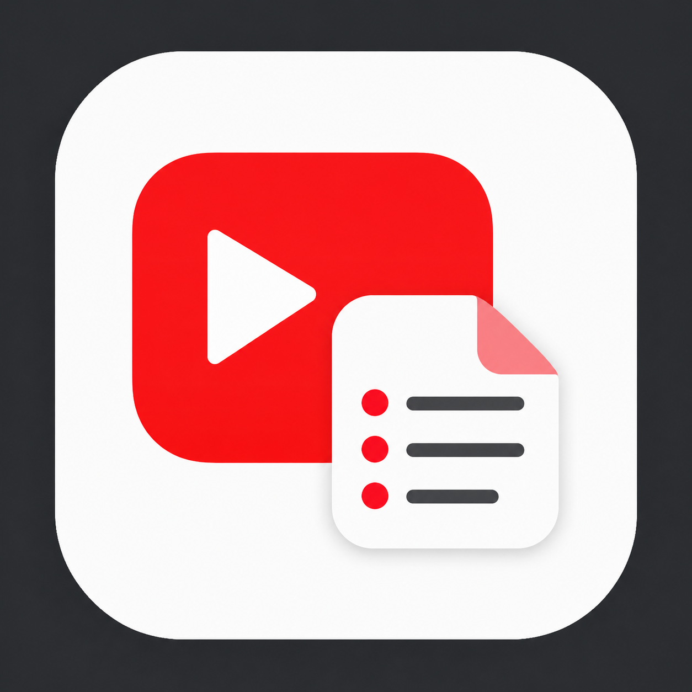

# YouTube Summary



YouTube動画の字幕を取得し、ユーザー指定のAI API (Claude / OpenAI / Gemini) で日本語または英語に要約する Chrome 拡張機能。

- 配布: Chrome Web Store (申請準備中)
- 方式: BYOK (Bring Your Own Key)
- 対応モデル (デフォルト、変更可):
  - Claude: `claude-sonnet-4-6`
  - OpenAI: `gpt-4o`
  - Gemini: `gemini-2.5-flash`

## 主な機能

- YouTube動画ページに「Summarize」ボタンを挿入
- Chrome サイドパネルで構造化された要約を表示 (見出し + 箇条書き)
- ざっくり / 中間 / 詳細の要約モード
- 要約のコピー / 再生成 / 中止
- UI言語と要約出力言語をそれぞれ日本語 / 英語で切替可能
- APIキーはブラウザのローカルストレージにのみ保存

## プライバシー

- 開発者はユーザーデータを収集しません
- 要約実行時のみ、字幕本文・動画ID・出力言語が、ユーザーが選択したAIプロバイダの公式APIへ送信されます
- 詳細: [プライバシーポリシー (日本語)](./docs/privacy.md) / [Privacy Policy (English)](./docs/privacy.en.md)

## 開発

```bash
npm install
npm run dev      # Vite + crxjs で開発ビルド
npm run build    # 本番ビルド (dist/)
npm run typecheck
```

ビルド構成と仕様は [`SPEC.md`](./SPEC.md) を参照。

## ライセンス

このリポジトリのソースコードは **閲覧のみ可能** です。複製・改変・再配布・利用は許可していません。詳細は [LICENSE](./LICENSE) を参照してください。
